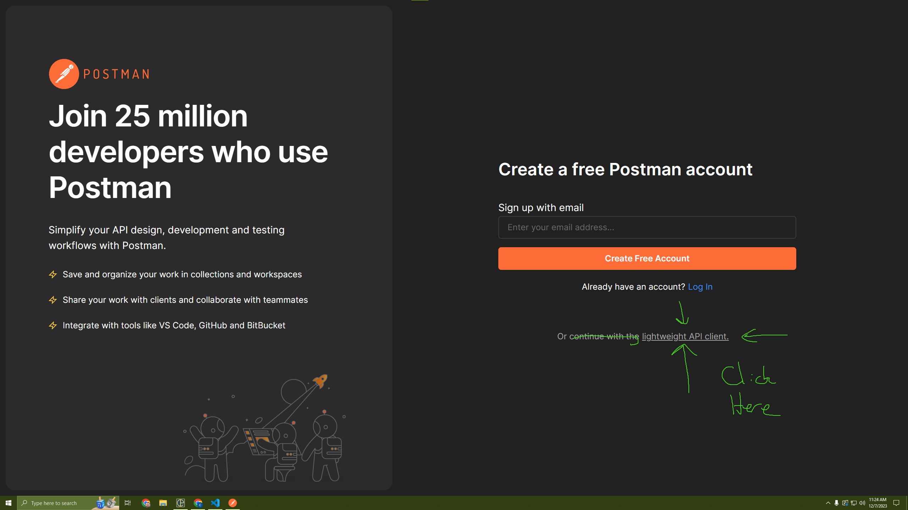
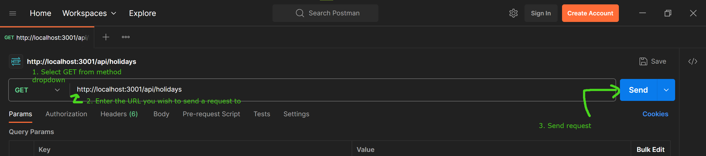
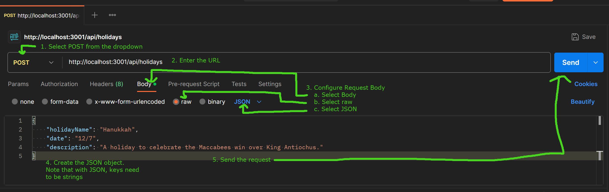
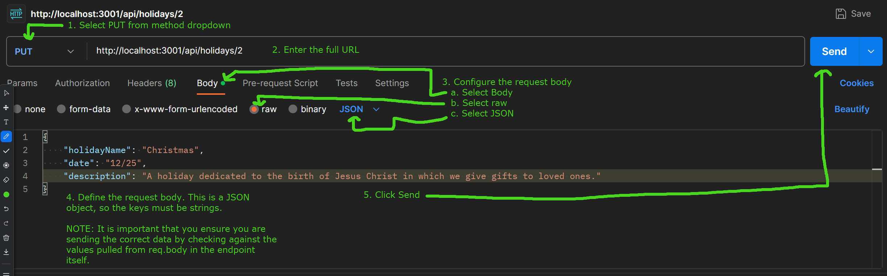
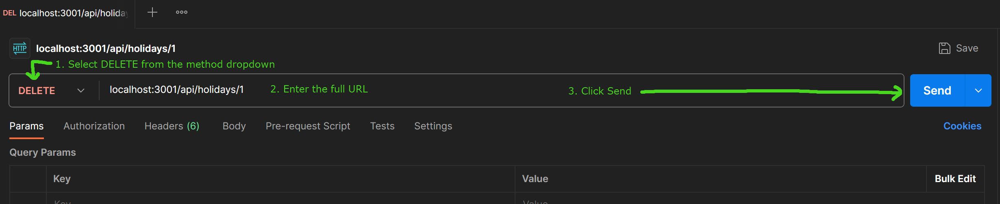

# HTTP Response Status Codes

## Cheat Sheet - Response Codes You Will Use Most
- `200` - request successfully handled
- `400` - request failed due to client error
- `401` - request made by non-logged in user
- `404` - route or resource doesn't exist
- `422` - invalid form submission
- `500` - server broke :(

## Detailed descriptions

### Successful Response Codes
- `200` - A 200 response code indicates that the action was successful.
  - `GET` - the resource is included in the response body
  - `POST` - a representation of the result of the action is in the response body
    - This often means the response body is the newly created resource
  - `PUT` - a representation of the result of the action is in the response body
    - This often means the response body is the updated resource
  - `DELETE` - the response body doesn't necessarily include anything; the 200 status indicates the resource was successfully deleted.
    - A common practice is to have the response body include the deleted resource

### Client Error Response Codes
- `400` - A 400 response code indicates that the request either cannot or will not be processed by the server due a perceived error in how the request is formatted. 
- `401` - A 401 response code means that the request is not authorized. In short, the user triggering the request is not logged in.
- `403` - Like the 401 response code, this means that the resource will not be provided due to the client not being authorized. However, the difference between the 401 and 403 is that with a 403 response, it means the client has been authenticated (i.e. the user has logged in), but they do not have the proper privileges.
- `404` - A 404 response code indicates that the resource being requested does not exist. This is commonly used when a request is sent to a route that does not exist, or the resource being requested has been deleted.
- `422` - A 422 response code indicates an invalid form submission. The request was sent to the proper URL with the correct HTTP method, but the request body cannot be processed due to invalid submission of data.
- `429` - A 429 response code indicates that too many requests have been sent. This is commonly found as a response when using a rate limited API. 

### Server Error Response Codes
- `500` - A 500 response code indicates that an error occurred on the server, and the server was not built to handle that specific error.

# Postman Walkthrough
- Download [Postman](https://www.postman.com/downloads/)
- Open the app, and select Continue with Lightweight Client   
  
## Testing GET Requests

1. Select `GET` from the method dropdown to the left of the URL bar
2. Enter the URL (this includes `localhost`, the `port`, and the full URL of the endpoint)
3. Click Send
4. The results will appear on the lower half of the window.

## Testing POST Requests
  
1. Select `POST` from the method dropdown to the left of the URL bar
2. Enter the URL
3. Configure the Request Body
   1. Select `Body`
   2. Select `raw`
   3. Select `JSON`
4. Define the request Body
> NOTE: This is a JSON object, so the object keys must be strings
5. Click Send

## Testing PUT Requests
  
1. Select `PUT` from the method dropdown to the left of the URL bar
2. Enter the URL
3. Configure the Request Body
   1. Select `Body`
   2. Select `raw`
   3. Select `JSON`
4. Define the request Body
> NOTE: This is a JSON object, so the object keys must be strings
5. Click Send

## Testing DELETE Requests
  
1. Select `DELETE` from the method dropdown to the left of the URL bar
2. Enter the URL
3. Click Send
4. The results will appear on the lower half of the window.