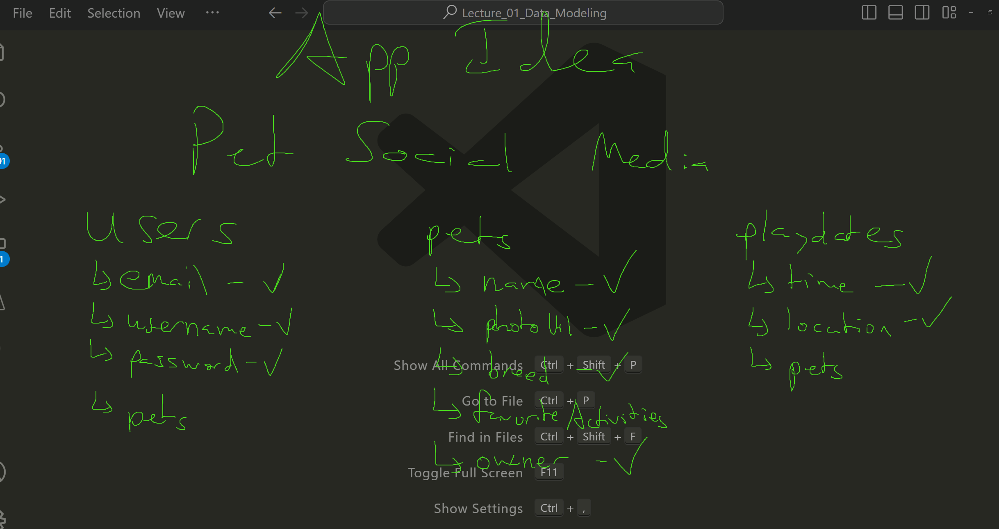

## Vocab
- **MongoDB** - NoSQL (not only structured query language) database that allows us to save resources. MongoDB databases consist of collections of documents
- **mongoose** - A node library (a.k.a. a back-end JavaScript library) used to connect a back-end application (such as an Express application) to a MongoDB database. Mongoose will allow us to not only query for resources, but also set the rules of what can be stored in the database. MongoDB is separate from mongoose.
- **Schema** - A schema maps to a MongoDB collection and defines the shape of the documents within that collection. The schema is where we can set the rules of what are considered valid values and invalid values. Thus, by defining a proper Schema, we can ensure that every single document in that schema's collection has the same kind of information.
- **documents** - an individual resource saved within a MongoDB database. For example, in Snippets, whenever a new users is created, a user document is inserted into the database.
- **collections** - a group of related documents within a MongoDB database. For example, the Snippets has two collections; users and posts
- **Model** - A mongoose model is a complex data type that links a schema to a collection in a MongoDB Database. Additionally, the model contains all of the methods needed to send queries to the database. The query methods will allow us to retrieve, create, update, and delete documents.

## Screenshots
  
